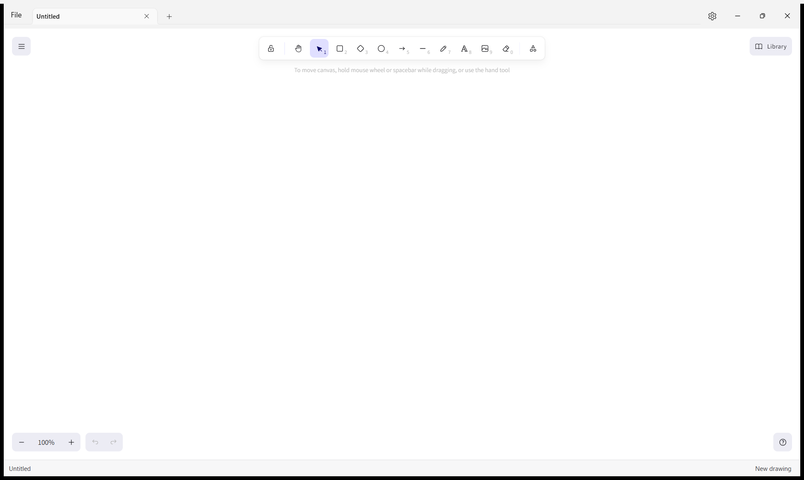
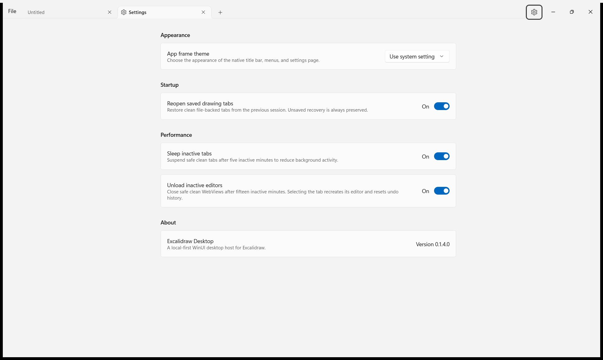

# Excalidraw Desktop

A local-first Windows desktop home for Excalidraw, with native tabs, native file
handling, session recovery, and an editor that works without a network
connection.

> [!NOTE]
> Excalidraw Desktop is in active development. There is not yet a public
> installer, so the current version must be built from source.

## For users

### What is Excalidraw Desktop?

Excalidraw Desktop combines the hand-drawn Excalidraw canvas with a native
Windows 11 shell. Drawings open in familiar desktop tabs and are saved as
portable `.excalidraw` files that can also be opened by other Excalidraw
clients.

The editor bundle is stored locally after installation. Opening, editing, and
saving a drawing does not require an internet connection or an account.



### Highlights

- Open several drawings in native, reorderable title-bar tabs.
- Create, open, save, and save-as through native Windows file dialogs.
- Export the complete drawing—including off-screen content—as a PNG through a
  native Windows save dialog.
- Open `.excalidraw` files from Explorer, drag files into the window, or return
  to a recent drawing from the File menu.
- Restore clean drawing tabs when the app starts again.
- Recover unsaved work after an unexpected shutdown.
- Detect when another program changes, moves, or deletes an open file before
  it is overwritten.
- Suspend or unload safe inactive tabs to reduce background resource use.
- Follow the Windows light or dark theme, or choose a theme for the app frame.
- Follow the Windows display language or choose English, Spanish, French,
  German, Brazilian Portuguese, Japanese, Simplified Chinese, or Arabic.
- Keep each drawing isolated in its own editor session.

### Everyday use

Use the **File** menu to create and manage drawings, the **+** button to open a
new tab, and the gear button to open Settings. The status bar at the bottom of
the native window reports the active drawing's file path, save state, recovery
state, and any external file conflict.

Use **File > Export whole drawing as PNG…** to create a 2× PNG containing the
entire scene. Exporting does not change the drawing's `.excalidraw` file,
recent-file entry, recovery snapshot, or unsaved status.

The main document shortcuts are:

| Action | Shortcut |
| --- | --- |
| New drawing tab | `Ctrl+N` |
| Open a drawing | `Ctrl+O` |
| Save | `Ctrl+S` |
| Save as | `Ctrl+Shift+S` |
| Close the active tab | `Ctrl+W` |

Right-click a drawing tab to copy its path, reveal it in Explorer, or close a
group of tabs. If a tab has unsaved work, Excalidraw Desktop asks what to do
before closing it.

### Settings

Settings are displayed in a native tab alongside drawings. They control the
app-frame theme, application language, startup tab restoration, and inactive-tab
resource use. Language changes are saved immediately and apply after restarting
the app so the native shell and every editor stay in the same language.



### Current availability

Excalidraw Desktop currently targets Windows 11 on x64 PCs and requires the
Microsoft Edge WebView2 Runtime. The application is distributed as a
self-contained folder: extract the complete archive and run
`ExcalidrawDesktop.exe`. Keep the executable and its accompanying files
together. Windows may ask you to choose Excalidraw Desktop the first time you
open an `.excalidraw` file from Explorer.

If an editor tab cannot start, use its **Retry** action first. The failure view
also links to Microsoft's
[WebView2 download and repair page](https://developer.microsoft.com/en-us/microsoft-edge/webview2/).
Install or repair the Evergreen WebView2 Runtime, restart Excalidraw Desktop,
and retry the tab. A failed editor does not overwrite its saved drawing.

This project is an independent desktop host for the open-source
[Excalidraw](https://github.com/excalidraw/excalidraw) editor. See
[THIRD_PARTY_NOTICES.md](THIRD_PARTY_NOTICES.md) for attribution and licensing
information.

---

## For developers

### Architecture

Excalidraw Desktop is an unpackaged, self-contained WinUI 3 application. The
published folder carries the .NET and Windows App SDK runtimes and can be
launched directly without registering an MSIX package. The native shell owns
windows, tabs, file dialogs, persistence, recovery, and OS integration. A local
React entry point hosts the public `@excalidraw/excalidraw` package inside
WebView2 and communicates with the shell through a typed JSON bridge.

Excalidraw is consumed as an exact-version npm dependency. Its upstream source
repository is not copied into this repository, and the generated web bundle is
not committed.

```text
ExcalidrawDesktop.App/         WinUI shell, native file lifecycle, and WebView2 host
ExcalidrawDesktop.Core/        Shared protocol, validation, recovery, and workspace logic
ExcalidrawDesktop.Core.Tests/  C# protocol and domain tests
ExcalidrawDesktop.Web/         React entry point and TypeScript bridge
SmokeTests/                    Unpackaged desktop integration tests
tools/                         Build and dependency-update scripts
docs/                          Plans, backlog, and validation records
ExcalidrawDesktop.sln          Visual Studio solution
```

### Prerequisites

- Windows 11 x64
- Visual Studio with WinUI application development tools
- Windows SDK 10.0.26100 or newer
- .NET 8 SDK or newer
- Node.js 18 or newer with Corepack
- Evergreen WebView2 Runtime

### Build and run

From the repository root, restore dependencies and build the complete desktop
application:

```powershell
.\tools\Build-Desktop.ps1
```

The script restores the exact npm dependencies, builds
`ExcalidrawDesktop.Web`, copies its offline bundle into
`ExcalidrawDesktop.App/Assets/Web`, and builds the native x64 application.
Generated web assets, `node_modules`, and .NET build output remain untracked.

After the first restore, publish and launch the unpackaged application with:

```powershell
.\tools\Build-Desktop.ps1 -SkipRestore -Publish -Launch
```

The runnable folder is written to
`ExcalidrawDesktop.App\bin\x64\<Configuration>\unpacked`. The application keeps
settings, workspace state, recovery snapshots, and diagnostics below
`%LOCALAPPDATA%\ExcalidrawDesktop`. Open `ExcalidrawDesktop.sln` in Visual
Studio when working on the native projects.

To build only the local web bundle:

```powershell
.\tools\Build-WebAssets.ps1
```

### Update Excalidraw

The editor version is pinned in `ExcalidrawDesktop.Web/package.json`. Update it
through the project-owned validation script:

```powershell
.\tools\Update-Excalidraw.ps1 -Version <version>
```

The script updates the package and lockfile, then runs the web typecheck and
tests, the .NET tests, and a complete desktop build. Review and commit the
package and lockfile changes only after validation succeeds.

### Tests

Run the desktop web typecheck and unit tests:

```powershell
Push-Location .\ExcalidrawDesktop.Web
corepack yarn typecheck
corepack yarn test
Pop-Location
```

Run the native protocol, persistence, and document tests:

```powershell
dotnet test .\ExcalidrawDesktop.sln -p:Platform=x64
```

Validate native localization catalogs, XAML resource references, and format
placeholders:

```powershell
.\tools\Test-Localization.ps1
```

Run the unpackaged startup and bridge-readiness smoke test:

```powershell
.\SmokeTests\Invoke-SmokeTest.ps1
```

Additional unpackaged suites cover tabs, workspace restoration, recovery,
title-bar interactions, inactive-tab suspension, performance, and Explorer
file activation:

```powershell
.\SmokeTests\Invoke-TabbedSmokeTest.ps1 -SkipBuild
.\SmokeTests\Invoke-WorkspaceRestoreSmokeTest.ps1 -SkipBuild
.\SmokeTests\Invoke-RecoverySmokeTest.ps1 -SkipBuild
.\SmokeTests\Invoke-TitleBarTabsSmokeTest.ps1 -SkipBuild
.\SmokeTests\Invoke-TabSuspensionSmokeTest.ps1 -SkipBuild
.\SmokeTests\Invoke-TabPerformanceTest.ps1 -SkipBuild
.\SmokeTests\Invoke-FileActivationSmokeTest.ps1 -SkipBuild
.\SmokeTests\Invoke-LocalizationSmokeTest.ps1 -SkipBuild
```

Use `-SkipBuild` to test the existing published output or `-KeepRunning` to
leave a successful test instance open.

### Project status and plans

The native tabbed workspace, file lifecycle, settings, workspace restoration,
recovery snapshots, external-file conflict handling, and inactive-tab resource
management are implemented. Manual accessibility, input, scaling, and theme
validation remain before the current tabbed-workspace phase is complete.

- [Desktop backlog](docs/DESKTOP_BACKLOG.md)
- [WinUI implementation plan](docs/WINUI_DESKTOP_PLAN.md)
- [Tabbed workspace plan](docs/TABBED_DESKTOP_PLAN.md)
- [Future product roadmap](docs/FUTURE_DESKTOP_ROADMAP.md)
- [Validation records](docs/validation)

### License

Excalidraw Desktop is licensed under the [MIT License](LICENSE). Third-party
software retains its own license; see
[THIRD_PARTY_NOTICES.md](THIRD_PARTY_NOTICES.md).
